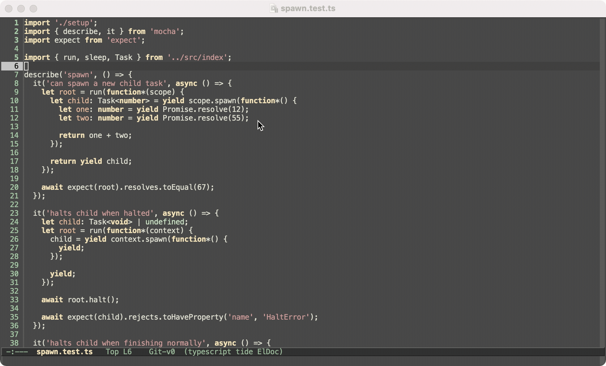

## frontside-windowing

Make window navigation consistent and intuitive.

It's annoying when you're using a lot of multi-window flows  commands that render their output in a separate window are  either splitting horizontally, or sometimes they open above, or sometimes they open above.

This makes the split consisent wherever possible by always splitting vertically, and in half.

In addition, this adds keybindings to make window navigation work similarly to tabbed navigation.

Finally, native scroll bars on frames are disabled because emacs provides its own scrollbars, so anything else is really just a double-render

Below is an example of runing a compilation within a project.  window splits in half, and to the right. Arrow keys are used to navigate between it.

https://github.com/thefrontside/frontmacs
